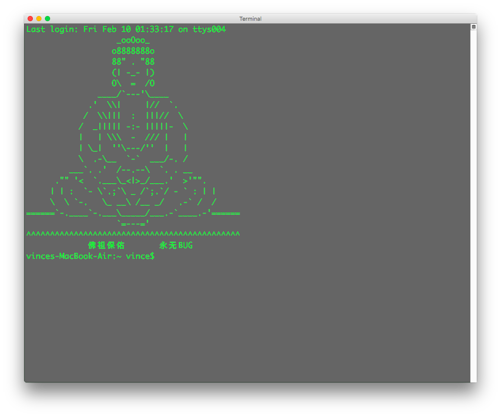

# Mac - 自定义终端初始画面


## Setup
1. Open Terminal
2. Type `sudo nano /etc/motd` and type your user's password
3. Type what you want, like

	```
	               _ooOoo_
                  o8888888o
                  88" . "88
                  (| -_- |)
                  O\  =  /O
               ____/`---'\____
             .'  \\|     |//  `.
            /  \\|||  :  |||//  \
           /  _||||| -:- |||||-  \
           |   | \\\  -  /// |   |
           | \_|  ''\---/''  |   |
           \  .-\__  `-`  ___/-. /
         ___`. .'  /--.--\  `. . __
      ."" '<  `.___\_<|>_/___.'  >'"".
     | | :  `- \`.;`\ _ /`;.`/ - ` : | |
     \  \ `-.   \_ __\ /__ _/   .-` /  /
======`-.____`-.___\_____/___.-`____.-'======
                   `=---='
^^^^^^^^^^^^^^^^^^^^^^^^^^^^^^^^^^^^^^^^^^^^^
             佛祖保佑       永无BUG
	```
	
4. Then press `Control + x` -> `y` -> `Enter`
5. Press `Command + n` to view it